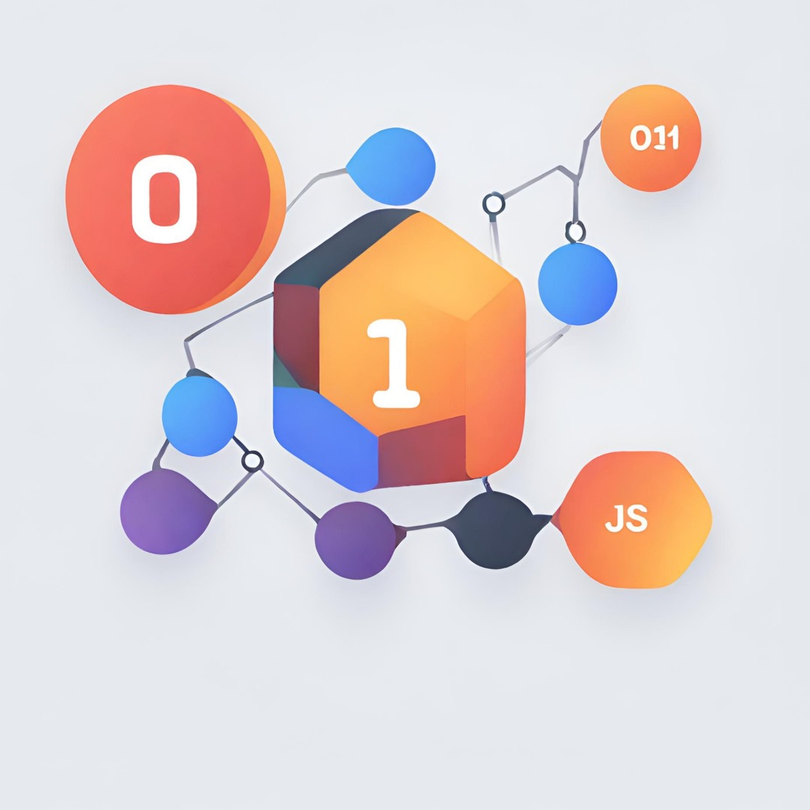

# Mini-Framework Documentation

 

## Introduction

Welcome to the documentation for **01JS** our mini-framework! This guide will equip you with the knowledge to effectively use our framework and create interactive web applications. Our framework simplifies essential web development tasks, including:

- **DOM Manipulation:** Create, manipulate, and dynamically append elements with ease.
- **Routing System:** Seamlessly manage navigation between different application views.
- **State Management:** Efficiently track user interactions and update the UI accordingly.
- **Event Handling:** Responsively handle various user events like clicks, scrolls, and keybindings.

## Getting Started

### Installation

To begin using our framework, follow these steps:

1. Include the necessary JavaScript files from our framework in your project.
2. Import the required modules to start utilizing the framework's functionalities.
3. Construct your web application using the provided methods for creating elements, handling events, managing state, and defining routes.

## Core Concepts

### 1. DOM Manipulation

#### `createElement(virtualDom, appendTo?, type?)` function:

- **Parameters:**
  - `virtualDom`: An object representing the HTML element structure.
  - `tag`: The HTML tag name (e.g., "div", "span").
  - `attrs` (optional): An object containing element attributes (e.g., id, class).
  - `children` (optional): An array of child elements or text nodes.
  - `event` (optional): An object specifying an event listener (explained later).
  - `appendTo` (optional): The ID or class of the existing element to append the new element to. If not provided, appends to the document body.
  - `type` (optional): Specifies how to target the existing element: "id" or "class".

**Code Example:**
```javascript
import { newElement } from './dom.mjs';

// Create a div with class "container" and text content
const element = {
  tag: 'div',
  attrs: { class: 'container' },
  children: ['Hello, World!']
};

// Append to document body by default
newElement(element);  

// Append to element with ID 'my-container'
newElement(element, 'my-container', 'id'); // Specify appendTo with ID

```


### 2. Routing
#### Router Class:
- `Constructor`: Takes an object mapping routes (URLs) to functions (components).
- `loadCurrentView() method`: Renders the component associated with the current URL hash fragment. Logs an error if no match is found.
**Code Example:**
```javascript
import { Router } from './route.mjs';

const routes = {
  '/': () => console.log('Home Page'),
  '/about': () => console.log('About Page')
};

const router = new Router(routes);
router.loadCurrentView();

```

### 3. State Management
#### HdleState Class:
- `Constructor`: Takes an optional initial state object.
- `get() method`: Returns a copy of the current state (prevents direct mutation).
- `set(fn) method`: Updates the state using a function that receives the current state and returns the new state.

**Code Example:**
``` javascript
import { HdleState } from './state.mjs';

const initialState = { count: 0 };
const state = new HdleState(initialState);

const incrementCount = () => {
  state.set(prevState => ({ ...prevState, count: prevState.count + 1 }));
};

console.log(state.get()); // { count: 0 }
incrementCount();
console.log(state.get()); // { count: 1 }

```

### 4. Event Handling
#### hdleEvent(event, element, func) function:
Registers an event listener on the specified element.
Calls the provided function when the event occurs.

**Code Example:**
``` javascript
    import { hdleEvent } from './event.mjs';

const button = document.getElementById('myButton');
hdleEvent('click', button, () => {
  console.log('Button clicked!');
});
```

### Authors

- ***C***heickh NDIAYE ( [*cheikhndiaye9*](https://learn.zone01dakar.sn/git/cheikhndiaye9) )

- ***M***asseck THIAW ( [*mthiaw*](https://learn.zone01dakar.sn/git/mthiaw) ) - **captain 👑**

- ***V***incent Félix NDOUR ( [*vindour*](https://learn.zone01dakar.sn/git/vindour) )

- ***S***erigne Khadim DIENE ( [*sdiene*](https://learn.zone01dakar.sn/git/sdiene) )


#### *@Licensed by team CMVS*